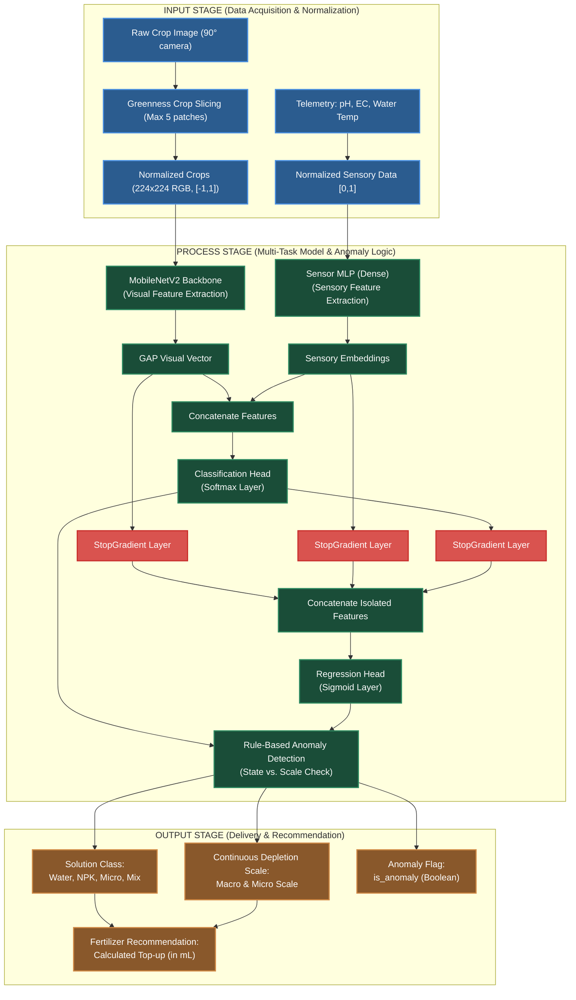

[Prev](./page-47-model-evolution-history.md) | [Index](../README.md)

# Guide for Capstone Section 3.2: Conceptual Framework (V11 AI Model)

This guide helps you update **Section 3.2 (Conceptual Framework)** of your manuscript to match the actual implementation of the **V11 Multi-Task Model** (`leafcloud_multimodal_v11_20260602_2123.keras`).

---

## 1. Executive Summary & Why We Update This

In the original manuscript, the conceptual framework was high-level and did not capture the actual machine learning mechanics. In the final **V11 Model**, we transitioned to an **Independent Dual-Fusion Architecture with Complete Gradient Isolation**. 

### What changes in the V11 data flow?
1. **Inputs (Data Acquisition)**: We don't just feed raw images; we perform a **Greenness-based Crop Selection** (extracting up to 5 plant canopy patches to filter out background soil/cocopeat noise) and normalize both the images (scaled to $[-1, 1]$) and the sensory data (scaled to $[0, 1]$ using physical limits).
2. **Process (Multimodal AI & Gradient Isolation)**: The model uses **MobileNetV2** for images and a **Sensor MLP** for telemetry. Features are combined but separated into two independent branches. A custom `StopGradient` layer blocks regression losses from corrupting the classification features during backpropagation.
3. **Outputs (Deliverables)**: The system outputs a classification state, continuous scaling depletions (Macro/Micro scales), an anomaly flag (cross-checks the state vs scale), and computes the exact fertilizer top-up volume (in mL) based on the active reservoir volume (e.g., 6 liters).

---

## 2. Cebuano/Bisaya Explanation (Para sa Defense)

Aron mas sayon ninyo ipasabot sa mga panel members kung giunsa pagproseso sa code ang inyong conceptual framework, ania ang giya sa Bisaya:

* **Inputs (Koleksyon ug Pag-normalize sa Data)**:
  * Dili diretso ang tibuok picture ang i-feed sa AI. Ang program mokuha og **5 ka crops** sa dahon base sa kapula o ka-green niini (*greenness threshold*). Gi-scale ang mga images sa $[-1, 1]$ ug ang sensor parameters (pH, EC, Water Temp) ngadto sa $[0, 1]$ gamit ang limit sa inyong setup (pananglitan, pH nga 3.0 hangtod 10.0, EC nga 0.0 hangtod 1.6 mS/cm).
* **Process (Independent Dual-Fusion & Gradient Isolation)**:
  * Ang visual features gikan sa **MobileNetV2** ug sensory features gikan sa **Sensor MLP** kay i-combine (*concatenate*).
  * Aron dili magkagubot o maguba ang features sa classification ug regression during joint training, gigamitan kini og **`StopGradient` layer**. Kini nga layer nag-block sa error/gradients gikan sa regression aron dili maapektuhan ang feature representations nga nakat-unan sa classification. Naghimo kita og duha ka independenteng agianan (*independent fusion paths*).
  * Nagdagan usab og **Rule-Based Anomaly Detection** sa server. E.g., Kon ang gi-classify sa AI kay "Water-only" apan ang regression niingon nga taas ang nutrient levels, i-flag kini sa system isip *anomaly* aron dili masayop ang top-up.
* **Outputs (Resulta ug Rekomendasyon)**:
  * Ang AI mohatag og classification state (`Water`, `NPK`, `Micro`, `Mix`), continuous scale values (`macro_scale` ug `micro_scale`), ug confidence score.
  * Gamit ang target volume sa styrofoam reservoir (pananglitan, 6 liters) ug ang target chemical concentration nga anaa sa `tank_configs` nga database table, kuwentahon sa system ang saktong **mililiters (mL)** sa liquid fertilizer nga kinahanglang idugang sa mag-uuma.

---

## 3. Mermaid Conceptual Framework Diagram (IPO Model)

Replace the old conceptual framework block diagram with this comprehensive systems diagram matching the actual code:



---

## 4. Manuscript Text Revisions (Section 3.2, Pages 32-33)

**Location in Manuscript:** [Lines 484-505 of LEAFCLOUD_-An-IoT-Driven-Mobile-App-for-Automated-NPK-Estimation-in-Hydroponic-Lettuce-Farming-Using-CNN.docx.md](file:///Users/fil/Fil/leafcloud/mimeng_leafcloud_server_v2/LEAFCLOUD_-An-IoT-Driven-Mobile-App-for-Automated-NPK-Estimation-in-Hydroponic-Lettuce-Farming-Using-CNN.docx.md#L484-L505)

### Target Wording (Old Text in Manuscript)
```text
The LEAFCLOUD system used a continuous step-by-step data process to turn raw sensor readings into clear recommendations for the farmer. This process was split into five stages:

* **Data Acquisition and Sampling Protocol:** Data was collected automatically from the 6-liter styrofoam reservoirs using the connected pH, EC, and temperature sensors while the camera took photos of the plants at the same time. The sensors were calibrated to read data together without electrical interference. To keep the water mixture even, the solution was stirred manually every day before readings were taken.

* **Data Transmission:** Raw sensor data and photos were sent from the Raspberry Pi to the backend server over a local wireless network and saved by date and time in the PostgreSQL database.

* **Data Analysis (Multimodal Processing):** The AI model on the server retrieved the latest plant photos and sensor readings. It combined the visual features of the plants with the water sensor data to classify the solution into one of four states: Water-only, Macro-only (NPK), Micro-only, or balanced Mix.

* **Information Delivery:** After finding the solution state, the system used math formulas to estimate the actual nutrient concentrations (NppmPppmKppm) and the total estimated parts per million (*total\_estimated\_ppm*). This calculation was based on the model classification, the 6-liter volume of the active styrofoam reservoir, and the chemical ratios of the fertilizers used. The results were packaged as JSON files and shared through a secure API built with FastAPI.

* **User Interaction:** The farmer interacted with the system through the mobile app. The dashboard displayed the estimated NPK values and the direct sensor readings (pH, EC, water temperature) when the app opened or when the user pulled to refresh. Historical trends were displayed on line charts for 7, 30, or 90 days. A background service checked the server and sent local notifications if nutrients were low, showing the exact amount of liquid fertilizer (in milliliters) needed to balance the active 6-liter styrofoam reservoir. Other reading errors were flagged with warnings on the dashboard screen.

**Figure 6**

*Conceptual Framework.*

![][image7]

Figure 6 shows the complete loop of the LEAFCLOUD system, showing how sensor data was collected, analyzed, and sent back to the farmer to help manage the styrofoam reservoir.
```

### Proposed Wording (New Copy-Pasteable Text)
```text
The LEAFCLOUD system is structured around an Input-Process-Output (IPO) model, translating environmental water telemetry and crop leaf morphology into precise, closed-loop fertilizer recommendations. This process is divided into the following stages:

* **Input (Data Acquisition & Preprocessing):** Raw telemetry (pH, Electrical Conductivity, and water temperature) is read from the active reservoir while the overhead camera captures lettuce crop canopy photos. The server executes a greenness-based cropping script, extracting up to five high-greenness crop patches to isolate lettuce leaves from backdrops of soil or cocopeat. Telemetry inputs are normalized to a [0, 1] range using target-bound scaling formulas, and image patches are standardized to a 224 x 224 pixel RGB grid normalized to a [-1, 1] interval.

* **Process (Isolated Multimodal AI & Anomaly Filtering):** The server processes the standardized data through a multi-task neural network. Visual features are extracted via a MobileNetV2 backbone, and numerical sensor readings are processed via a Multi-Layer Perceptron (MLP). The visual and sensory feature maps are concatenated and passed directly to a classification head (utilizing Softmax activation) to identify the solution state (Water, NPK, Micro, or Mix). To prevent task interference and gradient leakage, the concatenated features are routed to the regression head through custom StopGradient gates, isolating classification features from regression updates. The regression head (utilizing Sigmoid activation) computes continuous scaling values (macro_scale and micro_scale) representing nutrient depletion levels. Before delivery, the outputs are passed through a rule-based anomaly detection layer to flag inconsistencies (e.g., high regression scales alongside a 'Water' classification).

* **Output (Information Delivery & Recommendations):** The model outputs are combined with active tank configuration properties (volume in liters and fertilizer target thresholds). The server calculates the exact liquid fertilizer volume required (in milliliters) to balance the active reservoir. The predicted classification, continuous depletion scales, confidence score, anomaly flag, and milliliter recommendation are saved in the database and made available to the client application via a FastAPI endpoint.

* **Feedback Loop (User Interaction):** The mobile application retrieves the endpoint outputs to display real-time sensor metrics, crop statuses, and precise top-up recommendations on the dashboard. Visual warning banners flag anomalies, and history charts visualize 7, 30, or 90-day nutrient trends. A background service checks the server at set transmission intervals, sending local push alerts if nutrient levels drop below target bounds, instructing the farmer on the exact fertilizer dose (in mL) to add to the reservoir.

**Figure 6**

*Conceptual Framework of the LEAFCLOUD System (Input-Process-Output Model).*

[INSERT MERMAID DIAGRAM OR GENERATED DIAGRAM IMAGE HERE]

Figure 6 illustrates the system boundary and flow of information, starting from data acquisition, running through the gradient-isolated multimodal network and anomaly filters on the server, and ending with actionable dosing feedback delivered to the mobile client.
```

---

## 5. Summary of Code Alignment

| Conceptual Phase | Technical Implementation in `ai_service.py` | Code Reference |
| :--- | :--- | :--- |
| **Input: Crop Patches** | Greenness filtering and extraction of top 5 plant canopy crops. | [ai_service.py:L71-94](file:///Users/fil/Fil/leafcloud/mimeng_leafcloud_server_v2/app/services/ai_service.py#L71-L94) |
| **Input: Sensor Normalization** | Rescaling pH, EC, and water temp to $[0, 1]$ bounds. | [ai_service.py:L110-114](file:///Users/fil/Fil/leafcloud/mimeng_leafcloud_server_v2/app/services/ai_service.py#L110-L114) |
| **Input: Image Normalization** | Resizing crop patches to 224x224 and scaling pixel values to $[-1, 1]$. | [ai_service.py:L120-124](file:///Users/fil/Fil/leafcloud/mimeng_leafcloud_server_v2/app/services/ai_service.py#L120-L124) |
| **Process: Model Execution** | Invoking the V11 model with concatenated image and sensor inputs. | [ai_service.py:L127](file:///Users/fil/Fil/leafcloud/mimeng_leafcloud_server_v2/app/services/ai_service.py#L127) |
| **Process: Gradient Isolation** | Deserializing custom `StopGradient` layer to isolate regression and classification paths. | [ai_service.py:L20-43](file:///Users/fil/Fil/leafcloud/mimeng_leafcloud_server_v2/app/services/ai_service.py#L20-L43) |
| **Process: Anomaly Detection** | Checking for classification state vs. regression scale contradictions. | [ai_service.py:L145-156](file:///Users/fil/Fil/leafcloud/mimeng_leafcloud_server_v2/app/services/ai_service.py#L145-L156) |
| **Output: Dosing Recommendation** | Storing prediction states, scales, anomaly flags, and confidence scores. | [ai_service.py:L157-170](file:///Users/fil/Fil/leafcloud/mimeng_leafcloud_server_v2/app/services/ai_service.py#L157-L170) |
